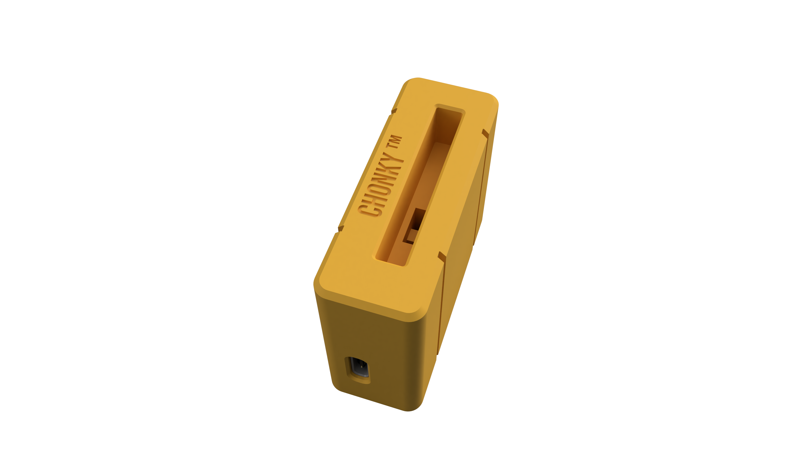
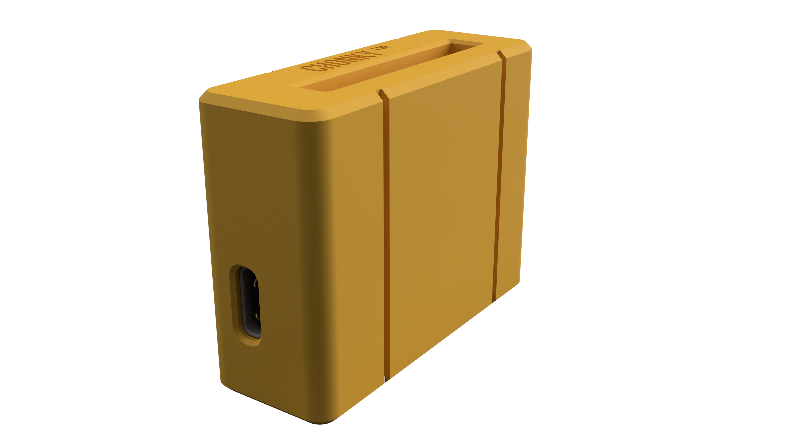
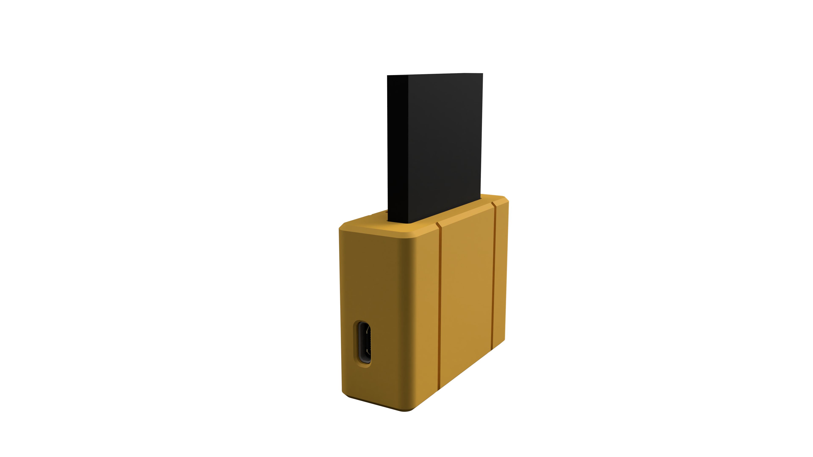
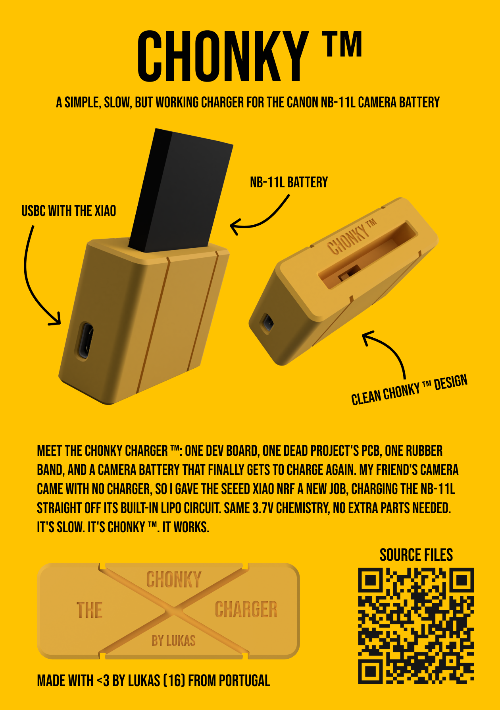

# chonky-charger

> A simple, slow, but working charger for the Canon NB-11L camera battery

This project was made for the NB-11L battery from a camera a friend gave me. It came without a charger, so I made my own! It's really simple: you take a Seeed XIAO nRF and use the built-in LiPo charger, since the battery chemistry is compatible. The NB-11L is a single cell 3.7V battery, which is exactly what the XIAO can charge. I also reused the XIAO PCB from my old project [Scroll Dial](https://github.com/maker-lukas/scroll-dial), which didn't quite work out, but the PCB worked just well enough for this project with the battery pins exposed. The charger is pretty slow, but it does charge.

## BOM

| Part | Qty | Specification | Price | Link |
|------|-----|---------------|-------|------|
| Case | 1 | 3D printed (top + bottom) | Self-printed | [3D files](3D) |
| Rubber band | 1 | Holds the battery in place | $0.90 | [aliexpress.com](https://pt.aliexpress.com/item/1005007314739524.html) |
| Screws | 2 | M2x5 flat head | $1.00 | [aliexpress.com](https://pt.aliexpress.com/item/1005005070119421.html) |
| MCU | 1 | Seeed XIAO nRF52840 | $13.09 | [mauser.pt](https://mauser.pt/095-1482/seeed-102010448-microcontrolador-seeed-studio-xiao-nrf52840-c-bluetooth-5-0-ble-nfc-e-carregamento-de-bateria) |
| PCB | 1 | XIAO PCB from [Scroll Dial](https://github.com/maker-lukas/scroll-dial) | ~$3 | [jlcpcb.com](https://jlcpcb.com) |
| Female jumper cables | 2 | To connect the battery to the XIAO | $0.80 | [aliexpress.com](https://pt.aliexpress.com/item/1005011947332215.html) |
| Male pin headers | 4 pins | Battery contacts + PCB contacts | $0.88 | [aliexpress.com](https://pt.aliexpress.com/item/1005009884599370.html) |
| **Total** | | | **~$19.67** | |

See [BOM.csv](BOM.csv) for the full bill of materials.

## Images

| | | |
|---|---|---|
|  |  |  |
| Angled view | Lower angle | Battery inserted |

## Zine

  
   
  
<a href="images/zine.pdf">Full PDF</a>

